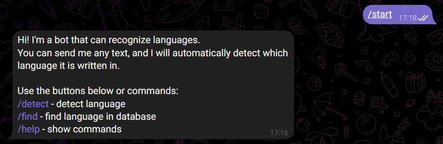
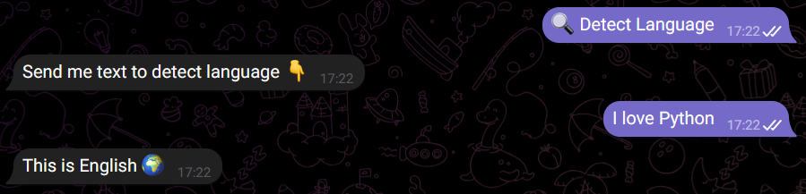
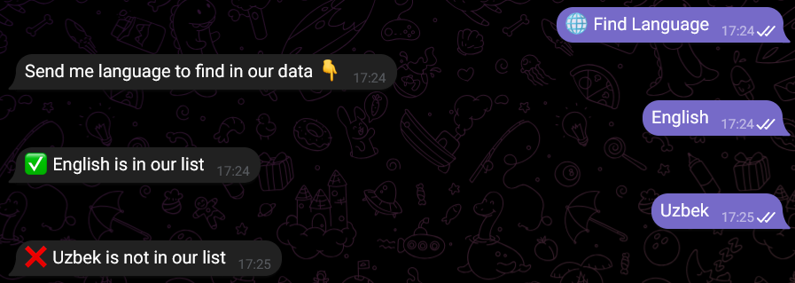
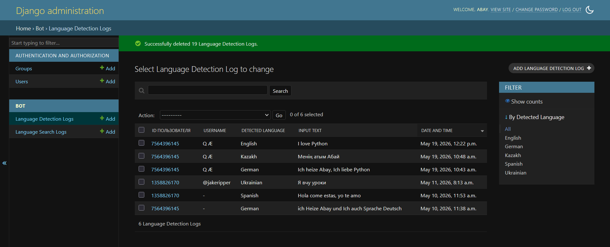

# Language Detector Bot 

## Project Description

A Telegram chatbot that automatically detects the language of any text sent by the user.
The bot also allows users to check if a specific language exists in the database.
All requests are saved to a SQLite database and can be viewed through the Django admin panel.

## Technologies Used

- Python 3.10
- python-telegram-bot 20+
- Django 4.2
- SQLite
- py3langid
- asgiref

## Installation

1. Clone the repository:
   git clone https://github.com/abiyamaha76-bit/language-detector-bot.git
   cd language-detector-bot

2. Create a virtual environment:
   python -m venv .venv
   .venv\Scripts\activate

3. Install dependencies:
   pip install -r requirements.txt

4. Run migrations:
   python manage.py migrate

5. Create an admin account:
   python manage.py createsuperuser

## How to Run

Terminal 1 — Django server:
   python manage.py runserver

Terminal 2 — Telegram bot:
   python bot/bot1.py

## Bot Commands

- /start — welcome message and main menu
- /detect — activate language detection mode
- /find — search for a language in the database
- /help — show available commands

## Examples

**Detecting a language:**
User sends: "Bonjour tout le monde"
Bot replies: "This is French 🌍"

**Finding a language:**
User sends: "Japanese"
Bot replies: "✅ Japanese is in our list"

User sends: "Klingon"
Bot replies: "❌ Klingon is not in our list"

## Screenshots

### Main Menu

### Language Detection

### Language Search

### Django Admin Panel

## Project Structure

myproject/
├── manage.py
├── requirements.txt
├── README.md
├── screenshots/
├── myproject/
│   ├── settings.py
│   ├── urls.py
│   └── wsgi.py
└── bot/
    ├── bot.py
    ├── models.py
    ├── admin.py
    └── apps.py
